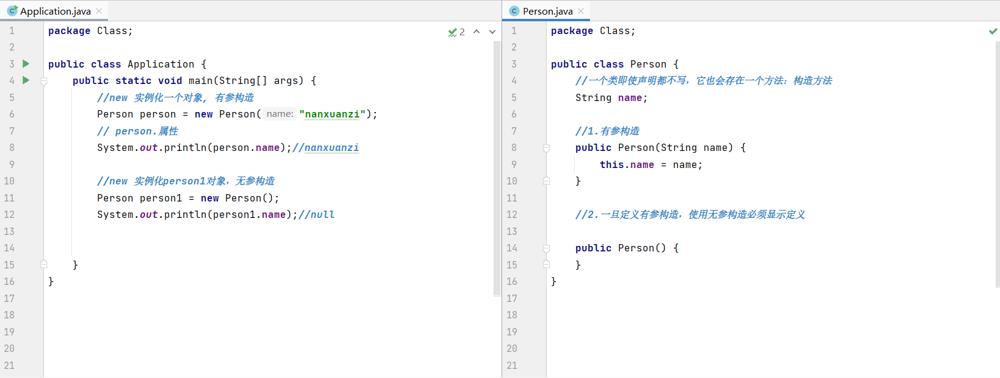

# 类

## 定义

```java
//类
public class Person{
    //静态的属性
    String name;
    
    //动态的方法
    public int add(){
        return 0;
    }
}
```


## 构造器



```java

```

**构造器：**

1. 和类名相同
2. 没有返回值

**作用：**

1. new 本质是在调用构造器
2. 初始化对象的值

**注意点：**

1. 定义有参构造之后，如果想使用无参构造，**显示的定义一个无参的构造**。